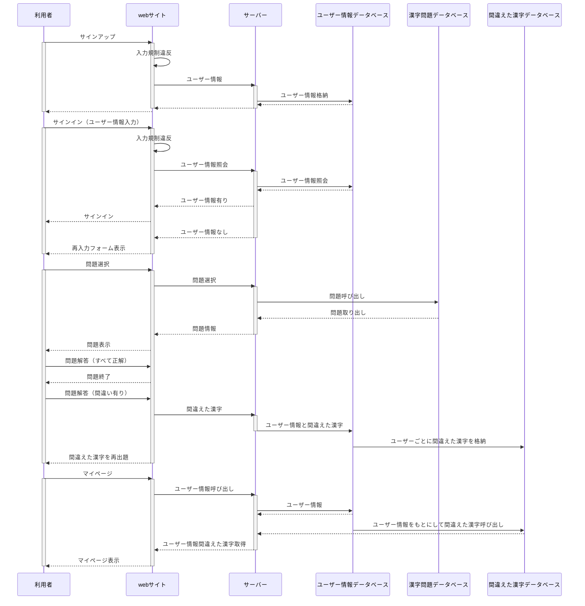

```mermaid
sequenceDiagram
　
　participant line_1 as 利用者
  
  participant line_2 as webサイト
  participant line_3 as サーバー
  participant line_4 as ユーザー情報データベース
  participant line_5 as 漢字問題データベース
  participant line_6 as 間違えた漢字データベース
  line_1 ->> line_2: サインアップ
  activate line_1
  activate line_2
  line_2 ->> line_2: 入力規制違反
  line_2 ->> line_3: ユーザー情報
  activate line_3
  line_3 ->> line_4: ユーザー情報格納
  line_4 -->> line_3: 
  line_3 -->> line_2: 
  deactivate line_3
  deactivate line_2
  line_2 -->> line_1: 
  deactivate line_1
  line_1 ->> line_2: サインイン（ユーザー情報入力）
  activate line_1
  activate line_2
  line_2 ->> line_2: 入力規制違反
  line_2 ->> line_3: ユーザー情報照会
  activate line_3
  line_3 ->> line_4: ユーザー情報照会
  line_4 -->> line_3: 
  line_3 -->> line_2: ユーザー情報有り
  line_2 -->> line_1: サインイン
  line_3 -->> line_2: ユーザー情報なし
  deactivate line_3
  line_2 -->> line_1: 再入力フォーム表示
  deactivate line_1
  deactivate line_2
  line_1 ->> line_2: 問題選択
  activate line_1
  activate line_2
  line_2 ->> line_3: 問題選択
  activate line_3
  line_3 ->> line_5: 問題呼び出し
  line_5 -->> line_3: 問題取り出し
  line_3 -->> line_2: 問題情報
  deactivate line_3
  line_2 -->> line_1: 問題表示
  line_1 ->> line_2: 問題解答（すべて正解）
  line_2 -->> line_1: 問題終了
  line_1 ->> line_2: 問題解答（間違い有り）
  line_2 ->> line_3: 間違えた漢字
  activate line_3
  line_3 ->> line_4: ユーザー情報と間違えた漢字
  deactivate line_3
  line_4 ->> line_6: ユーザーごとに間違えた漢字を格納
  line_2 -->> line_1: 間違えた漢字を再出題
  deactivate line_1
  deactivate line_2
  line_1 ->> line_2: マイページ
  activate line_1
  activate line_2
  line_2 ->> line_3: ユーザー情報呼び出し
  activate line_3
  line_3 ->> line_4: ユーザー情報
  line_4 -->> line_3: 
  line_4 ->> line_6: ユーザー情報をもとにして間違えた漢字呼び出し
  line_6 -->> line_3: 
  line_3 -->> line_2: ユーザー情報間違えた漢字取得
  deactivate line_3
  line_2 -->> line_1: マイページ表示
  deactivate line_1
  deactivate line_2
``` 
